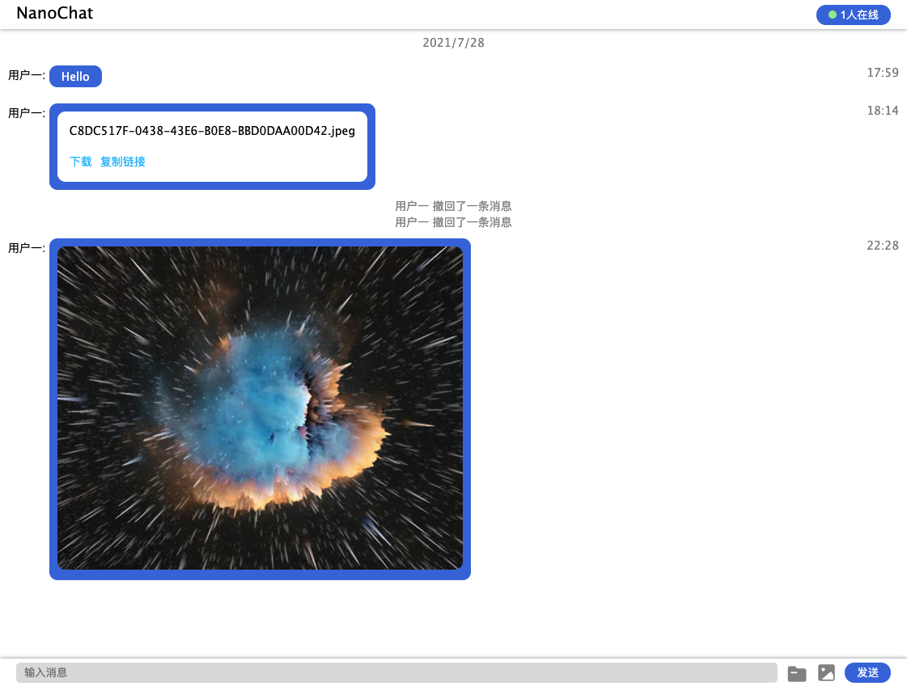

# NanoChat
使用NodeJS实现的简易实时聊天系统
## 屏幕截图

## 功能
✅ 长连接实时更新聊天内容

✅ 显示用户在线状态

✅ 撤回消息 发送图片和文件

## 使用说明
需要安装`node`，`npm`，并通过以下命令运行
```shell
npm start
```
### 环境变量
| 名称 | 说明 | 默认值 |
| :---: | :---  | :---: |
| PORT | 应用监听端口号 | 3000 |
| DATAPATH | 应用存放聊天数据路径 | ./data |
| ACCOUNTPATH | 应用存放用户数据路径 | ../account.json |
| MAXCONN | 最大连接数 | 30 |
| FILEEXPR | 文件保留时间（单位：秒）| 604800 |
| MAXUPDATE | 最大上传文件大小（单位：MB）| 20 |
### 用户配置文件格式
```json
[
  {
    "id": "用户代码",
    "name": "用户名",
    "class": "用户分组"
  }
]
```